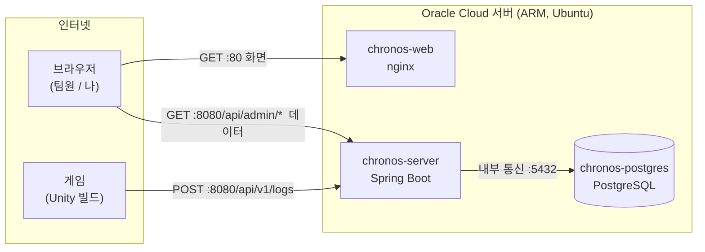
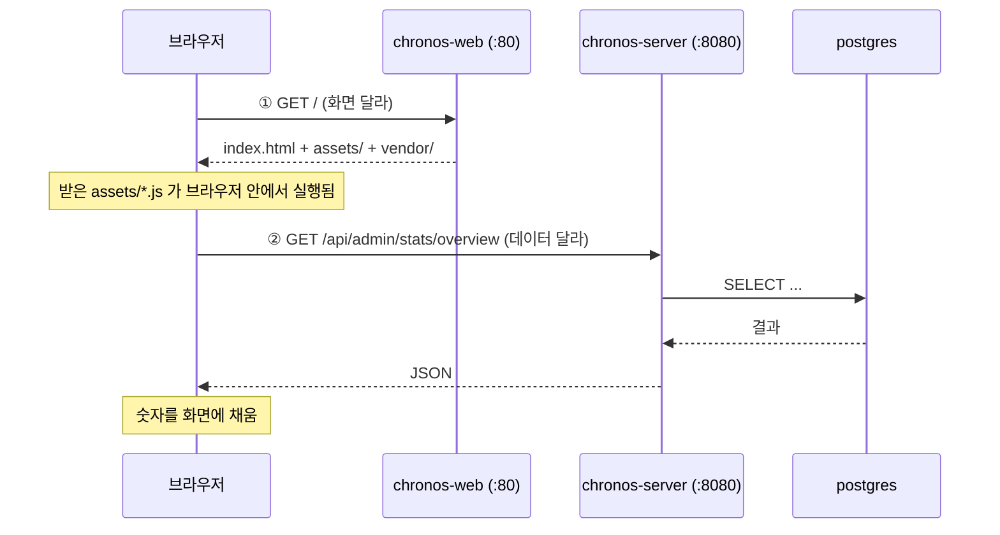
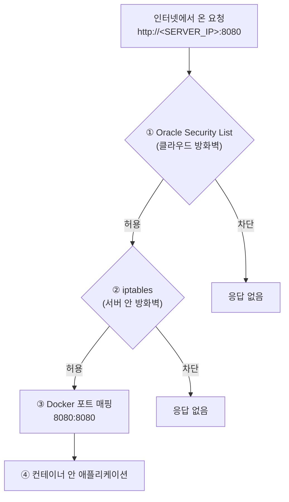
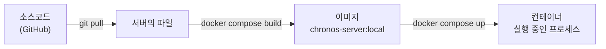
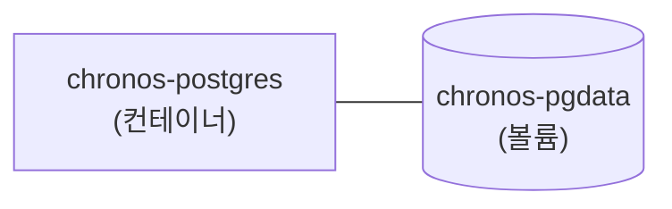
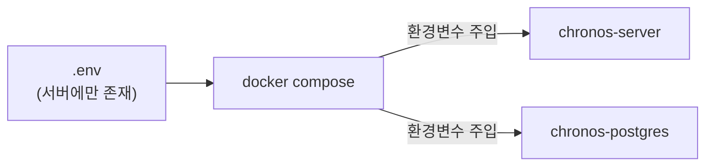
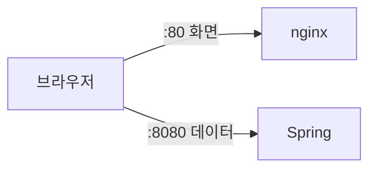
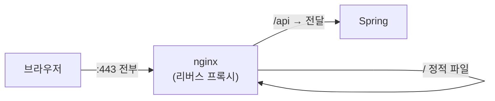

# Chronos 시스템 구조

> 초안. 읽고 이해되지 않는 부분을 표시해두면 다듬는다.
> 확정되면 README 로 옮기거나 링크한다.

이 문서는 **"게임에서 찍힌 로그 한 줄이 대시보드 화면에 숫자로 뜨기까지"**
무엇이 어떤 순서로 관여하는지를 설명한다.

> 📌 문서에 서버 주소를 쓸 때는 `<SERVER_IP>` 로 적었다.
> 저장소가 공개돼 있어 실제 IP를 박아두면 검색에 노출되기 때문이다.
> 현재 값은 로컬 `.env` 나 Oracle 콘솔에서 확인한다.

---

## 1. 한눈에 보기



**컨테이너 세 개**가 서버 한 대 위에서 돈다. 서로 다른 일을 한다.

| 이름 | 정체 | 하는 일 |
|---|---|---|
| `chronos-postgres` | PostgreSQL | 로그를 실제로 저장 |
| `chronos-server` | Spring Boot | 로그를 받아 DB에 넣고, 통계를 계산해 돌려줌 |
| `chronos-web` | nginx | 대시보드 화면(HTML·JS)을 브라우저에 전달 |

---

## 2. 왜 브라우저가 두 군데에 요청하는가

대시보드를 열면 요청이 **두 번** 나간다. 이게 처음에 제일 헷갈리는 부분이다.



- **①은 "빈 껍데기"** 다. 레이아웃과 자바스크립트만 들어 있다.
- **②는 그 껍데기가 스스로 채운다.** `assets/page-*.js` 가 브라우저 안에서 실행되면서 API를 부른다.

그래서 **`chronos-web` 만 살아 있고 `chronos-server` 가 죽으면**
화면은 뜨는데 숫자가 전부 비어 있는 상태가 된다. 실제로 그 상황을 여러 번 겪었다.

### `BASE_URL` 이 왜 문제였나

`assets/api.js` 는 **브라우저 안에서** 실행된다. 서버 안이 아니다.
그래서 거기 적힌 `localhost` 는 **서버가 아니라 접속한 사람의 PC**를 가리킨다.

```js
// 잘못된 버전 — 서버에 올리면 접속자 본인 PC의 8080을 찾는다
const BASE_URL = 'http://localhost:8080';

// 지금 버전 — 이 페이지를 내려준 호스트를 그대로 쓴다
const BASE_URL = `${location.protocol}//${location.hostname}:8080`;
```

---

## 3. 요청이 지나가는 관문들

바깥에서 온 요청은 **네 개의 문**을 통과해야 컨테이너에 닿는다.
하나라도 닫혀 있으면 "왜 안 되지" 상태가 된다.



| 문 | 누가 관리 | 어디서 설정 |
|---|---|---|
| ① Security List | Oracle Cloud | 웹 콘솔 → VCN → Security |
| ② iptables | Ubuntu | 서버에서 `sudo iptables ...` |
| ③ 포트 매핑 | Docker | `docker-compose.yml` 의 `ports:` |
| ④ 애플리케이션 | 우리 코드 | Spring / nginx 설정 |

**①과 ②를 둘 다 열어야 한다.** 한쪽만 열고 헤매는 경우가 가장 많다.

### 지금 열려 있는 포트

| 포트 | 용도 | 외부 공개 |
|---|---|---|
| 22 | SSH (서버 조작) | ✅ |
| 80 | 대시보드 화면 | ✅ |
| 8080 | 로그 수집 + 어드민 API | ✅ |
| 5432 | PostgreSQL | ❌ `127.0.0.1` 에만 묶음 |

5432 를 닫아둬도 `chronos-server` 는 DB에 잘 붙는다.
**컨테이너끼리는 포트 매핑과 무관하게 내부 네트워크로 통신**하기 때문이다.

---

## 4. 컨테이너 안에서의 이름

컨테이너 안에서 `localhost` 는 **그 컨테이너 자기 자신**이다. 옆 컨테이너가 아니다.
서로를 부를 때는 **서비스 이름**을 쓴다.

```yaml
SPRING_DATASOURCE_URL: jdbc:postgresql://postgres:5432/chronos
#                                        ~~~~~~~~ 서비스 이름
```

Docker Compose 가 컨테이너들만의 네트워크를 만들고 그 안에 DNS를 놔둔다.
`postgres` 라는 이름이 그 컨테이너의 주소로 해석된다.

집 안 공유기에 물린 기기들이 서로를 이름으로 부르는 것과 같고,
포트 매핑은 **공유기의 포트포워딩**에 해당한다.

---

## 5. 소스코드가 실행되기까지



- **이미지** = 실행에 필요한 것이 다 담긴 스냅샷. 그 자체로는 움직이지 않는다
- **컨테이너** = 이미지를 실행한 것

Java 로 치면 **이미지가 클래스, 컨테이너가 인스턴스**다.

### 이미지를 서버에서 직접 빌드하는 이유

CPU 아키텍처가 다르기 때문이다.

| | CPU | 이미지 |
|---|---|---|
| 내 PC (Windows) | x86_64 (amd64) | amd64 이미지 |
| Oracle 서버 | ARM (aarch64) | **arm64 이미지** |

amd64 이미지는 ARM 서버에서 실행되지 않는다.
그래서 `docker compose build` 를 서버에서 돌려 그 자리에서 만든다.

빌드는 컨테이너 안에서 일어나므로 **서버에 JDK나 Gradle을 설치할 필요가 없다.**
(`server/Dockerfile` 의 멀티스테이지 구성)

---

## 6. 데이터는 어디에 남는가

컨테이너는 지우면 안의 내용도 같이 사라진다.
DB 데이터가 날아가면 안 되므로 **볼륨**이라는 별도 저장 공간에 둔다.



- `docker compose down` → 컨테이너만 삭제. **볼륨은 남는다**
- `docker volume rm chronos-pgdata` → 데이터까지 삭제

이미지를 새로 빌드해서 컨테이너를 갈아끼워도 **쌓인 로그는 유지된다.**
코드를 고쳐 재배포해도 데이터가 사라지지 않는 이유다.

---

## 7. 비밀번호는 어떻게 전달되는가

DB 비밀번호는 소스코드에도, 이미지에도 들어 있지 않다.
저장소가 공개돼 있기 때문이다.



```
.env                POSTGRES_PASSWORD=xxxx
  ↓  Compose 가 읽음
docker-compose.yml  SPRING_DATASOURCE_PASSWORD: ${POSTGRES_PASSWORD}
  ↓  Docker 가 컨테이너 환경변수로 주입
application.yml     password: ${SPRING_DATASOURCE_PASSWORD}
  ↓  Spring 이 해석
DB 접속
```

중간에 이름이 한 번 바뀐다. `.env` 의 `POSTGRES_PASSWORD` 를
Compose 가 `SPRING_DATASOURCE_PASSWORD` 로 넘겨준다.

`.env` 는 `.gitignore` 에 걸려 있어 저장소에 올라가지 않는다.
그래서 **clone 만으로는 실행되지 않고, 서버에서 직접 만들어야 한다.**

---

## 8. 앞으로 붙일 것 — 리버스 프록시

현재는 화면과 데이터가 **서로 다른 포트**에서 온다.



여기에 nginx 가 `/api` 요청을 대신 받아 넘겨주도록 바꾸면 이렇게 된다.



**리버스 프록시**란 앞에서 요청을 받아 뒤의 서버로 넘겨주는 중계자다.
이렇게 바꾸면 얻는 것:

- 브라우저가 **한 곳만** 보므로 `BASE_URL` 이 필요 없어진다
- 출처가 같아지므로 **CORS 설정도 필요 없어진다**
- **인증서를 한 곳에만** 두면 되어 HTTPS 적용이 쉬워진다
- **Basic 인증을 한 자리에** 걸면 화면과 API가 동시에 보호된다

HTTPS 자체는 어렵지 않다. HTTP 에 TLS 암호화를 씌운 것이고 기본 포트가 443이다.
필요한 건 **인증서**뿐인데, Let's Encrypt 에서 무료로 받을 수 있다.
다만 **IP 에는 발급되지 않고 도메인이 있어야** 한다. DuckDNS 같은 무료 도메인이면 충분하다.

---

## 9. 현재 상태와 남은 것

**동작 확인된 것**

- ARM 서버에서 컨테이너 3개 기동
- 인터넷 → `:8080/api/v1/logs` 로 로그 적재 (curl 검증 완료)
- 인터넷 → `:80` 으로 대시보드 접속

**남은 것**

| 과제 | 왜 필요한가 |
|---|---|
| 게임 클라이언트 연결 | `ServerUrl` 을 서버 주소로. 실제 로그 적재 검증 |
| 인증 | 지금은 **누구나** 대시보드를 보고, **누구나** 가짜 로그를 밀어넣을 수 있다 |
| 도메인 + HTTPS | 비밀번호를 평문으로 보내지 않기 위해. 인증보다 먼저 |
| 어드민 API 명세 v2 | `docs/admin-spec.md` 가 5월 기준이라 현재 구현과 다르다 |
| 스키마 마이그레이션 | `CREATE TABLE IF NOT EXISTS` 라 기존 테이블에 컬럼 추가가 반영되지 않는다 |
| 서버 타임존 | 현재 UTC. "오늘" 집계 기준이 한국 시간과 다르다 |

가장 급한 것은 **인증**이다. 데이터가 쌓이기 시작하면 노출 범위가 커진다.
